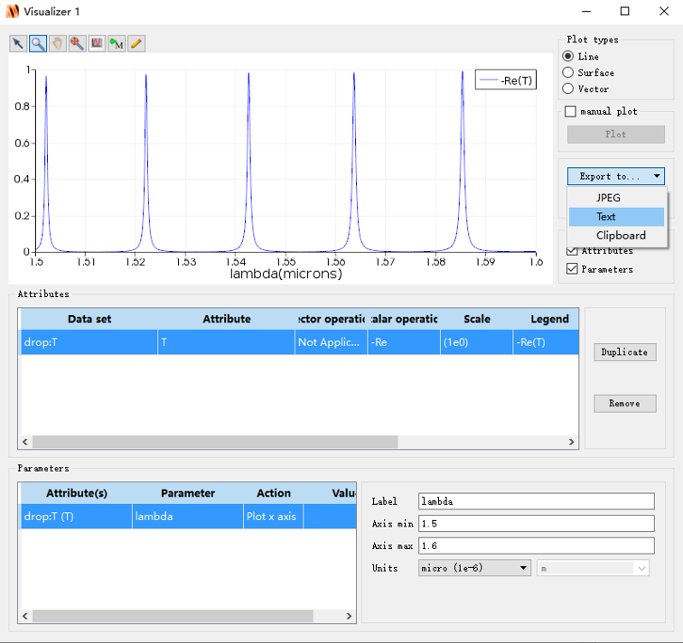

# Engineering Little Tools
 Some programs that can do help to my projects.

## Wavelength_IL_FWHM_Recording.m

It can analyze *transmission parameter* results from Lumerical FDTD，and save *resonance wavelength*, *insertion loss*, *FWHM* into a ".csv" file.

#### Attention

Make sure the FDTD output values are positive and save as *Text*. e.g. 

## Plot_Spectrum_with_IL_FWHM.m

A coarse program that can analyze *transmission parameter* results from Lumerical FDTD and re-plot the results in *dB* unit. Besides, it can calculate *resonance wavelength*, *insertion loss*, *FWHM* and print in *Matlab Command window*. 

Make sure the FDTD output values are positive and save as *Text*.

## EightCannel_Isolation_Cal.m

It can help analyze 8 resonance results from Lumerical FDTD and calculate *Channel Isolation* between each two of them, and save *Channel Isolation* into a ".csv" file.

Make sure the FDTD output values are positive and save as *Text*.

## Wavelength_IL_FWHM_Recording_Drop_Port.m

Based on *Wavelength_IL_FWHM_Recording.m*, analyze FSR in Microring Drop port.

## Wavelength_IL_FWHM_Recording_Through_Port.m

Based on *Wavelength_IL_FWHM_Recording.m*, analyze FSR in Microring Through port.

